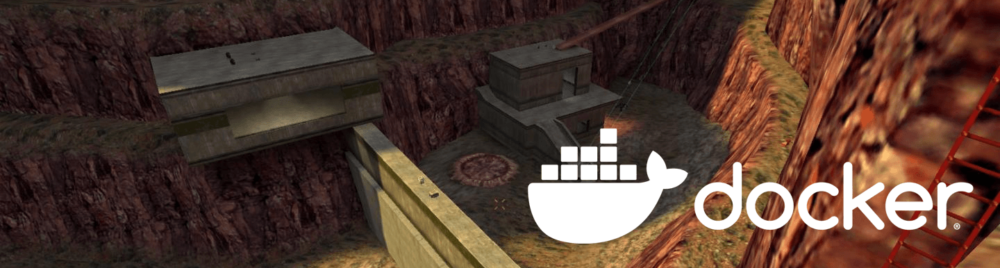

[](https://github.com/FWGS/xashds-docker/actions)
[](http://hits.dwyl.com/FWGS/xashds-docker)


# Xash3D FWGS Dedicated Server Docker
Probably, the fastest and easiest way to set up an old-school Xash3D FWGS
Half-Life Deathmatch Dedicated Server. You don't need to know
anything about Linux or XashDS to start a server. You just need installed Docker and this image.

## Quick Start
> **Note:** At the moment, we don't yet publishing pre-built images on Docker Hub. Therefore, you need to build it yourself.

### Building XashDS image manually
Clone this repository and build image with Docker Compose. Just two commands.

```bash
git clone https://github.com/FWGS/xashds-docker.git && cd xashds-docker
sudo docker compose build
```

Next, you can use this Compose file below as a base for your custom configuration. If you don't need custom configuration - just ignore it and continue to next step.

```yaml
services:
  xashds:
    image: xashdsdocker:latest
    build: .
    container_name: xashds
    restart: always
    tty: true
    stdin_open: true
    command: +map crossfire
    ports:
      - '27015:27015/udp'
```

> **Note:** Any [server config command](http://sr-team.clan.su/K_stat/hlcommandsfull.html)
  can be passed to `command` section in Docker Compose file. 

By default, server will start on 27015 UDP port. When you're finished with configuration and ready to start a server just run:

```bash
sudo docker compose up -d
```

After that, server will automatically start on system startup and auto-restarting in case of crash.

If you want to stop a server and completely remove all containers, run:
```bash
sudo docker compose down
```

## What is included
* Game assets from [HLDS](https://github.com/DevilBoy-eXe/hlds), build number `8308`
* [Xash3D FWGS](https://github.com/FWGS/xash3d-fwgs) dedicated server, latest version
* [Metamod-p](https://github.com/mittorn/metamod-p) for Xash3D by mittorn,
  version `1.21p37`
* [AMX Mod X](https://github.com/alliedmodders/amxmodx), version `1.9.0.5294`
* [jk_botti](https://github.com/Bots-United/jk_botti), version `1.43`
* Minimal config preset, such as `mp_timelimit`, `public 1` and mapcycle

## Default mapcycle
* crossfire
* bounce
* datacore
* frenzy
* gasworks
* lambda_bunker
* rapidcore
* snark_pit
* stalkyard
* subtransit
* undertow
* boot_camp
